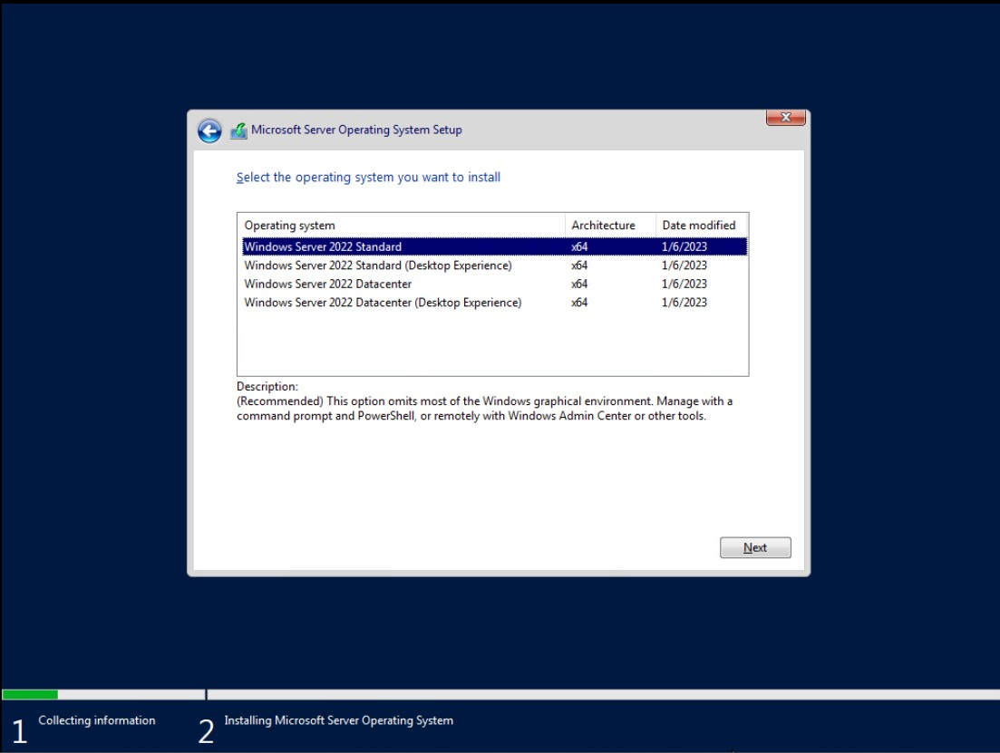
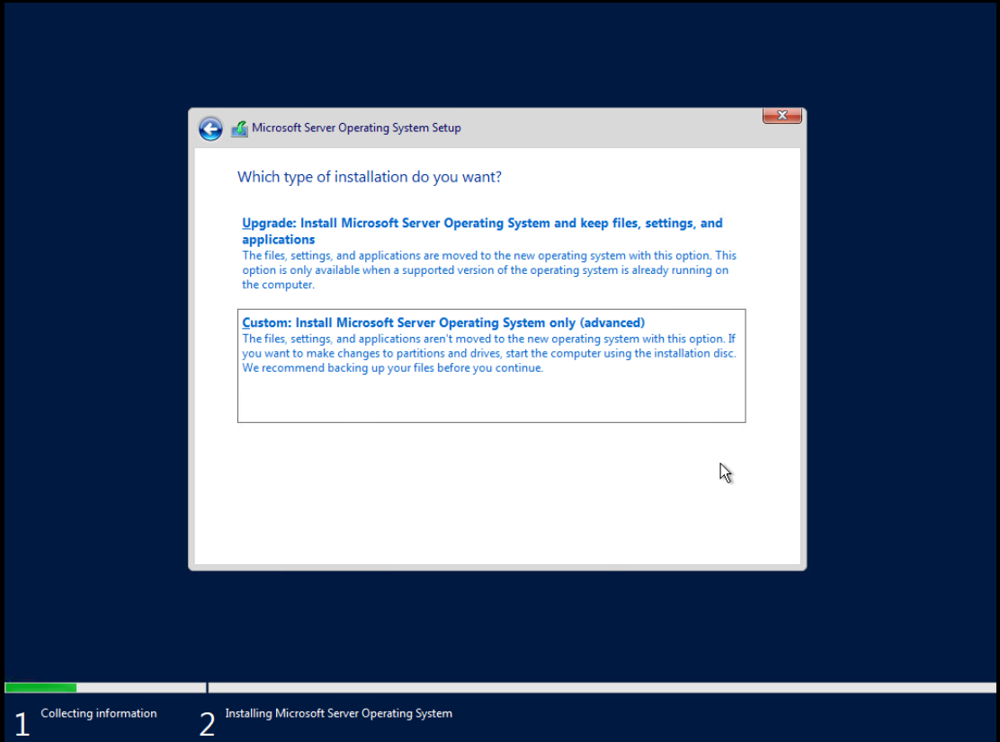
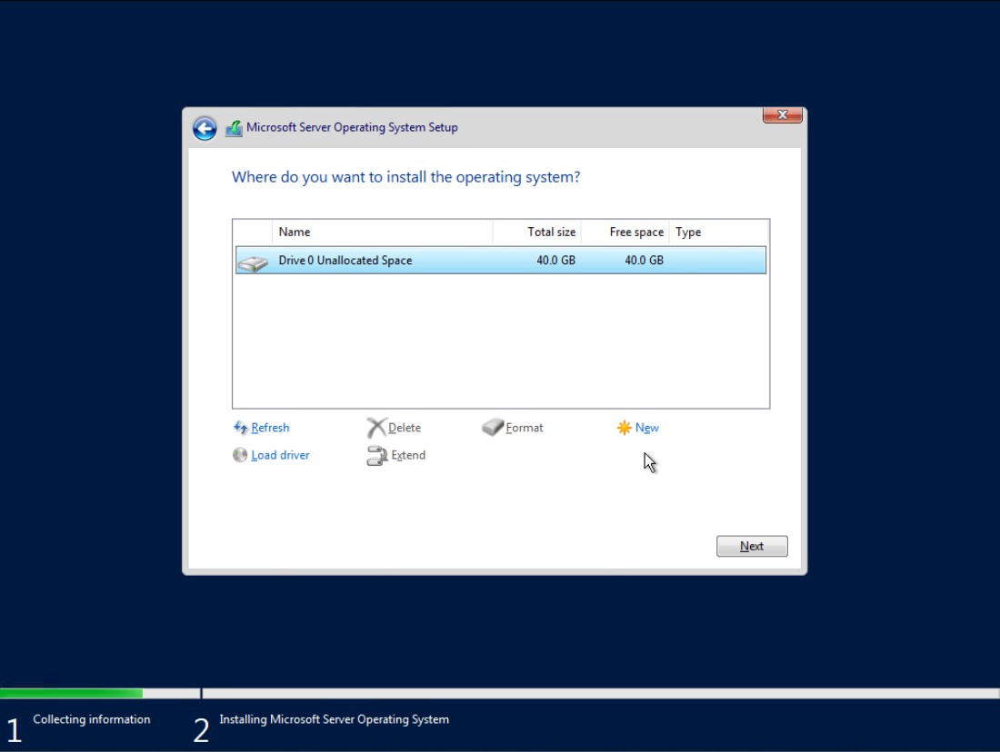

# Actualizar controladores de Dominio

## Instalación de Windows Server Core

En primer lugar crearemos una máquina nueva que será el futuro controlador de dominio principal. El nombre será **DC03-01.wargamesX**. Mantendremos la configuración por defecto que vCenter sugiere para Windows Server 2016 o versiones posteriores pero cambiando las opciones de disco duro a **aprovisionamiento fino** y la red a **PG-VLAN20**. Utilizaremos la última ISO del almacén para Windows Server 2022.

Arrancaremos desde la imagen y cambiaremos la distribución de teclado, presionaremos Install, diremos que no tenemos clave de producto, elegiremos la versión **Windows Server 2022 Standard**, elegiremos la opción personalizada y el disco en el que se instalará Windows.

