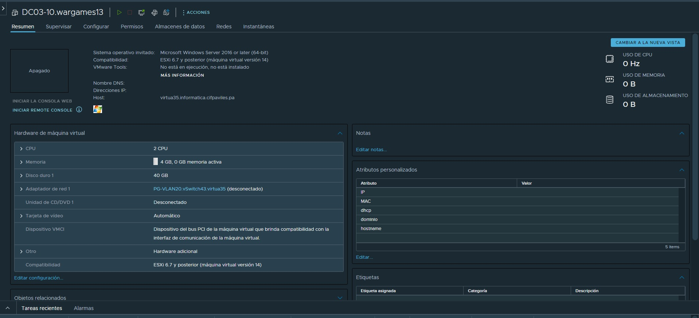

# Actualizar controladores de Dominio

## Instalación de Windows Server Core

En primer lugar crearemos una máquina nueva que será el futuro controlador de dominio principal. El nombre será **DC03-01.wargamesX**. Mantendremos la configuración por defecto que vCenter sugiere para Windows Server 2016 o versiones posteriores pero cambiando las opciones de disco duro a **aprovisionamiento fino** y la red a **PG-VLAN20**. Utilizaremos la última ISO del almacén para Windows Server 2022.



Arrancaremos desde la imagen y cambiaremos la distribución de teclado, presionaremos Install, diremos que no tenemos clave de producto, elegiremos la versión **Windows Server 2022 Standard**, elegiremos la opción personalizada y el disco en el que se instalará Windows.


## Post-Instalación

Una vez terminada la instalación, habrá que coonfigurar la red, habilitar el escritorio remoto (para poder subir los scripts) e instalar las Tools de VMware.

Windows Server Core cuenta con un menú llamado SConfig desde el que podremos realizar fácilmente la configuración inicial de el equipo


### Red

Para instalar la red seguiremos estos pasos, la configuración se realiza introduciendo una entrada desde el teclado y presionando intro para confirmar, la configuración de red es la número 8, por lo que habrá que escribir 8 y presionar intro.

Una vez ahí elegiremos la interfaz, que queremos configurar escribiendo su número de índice y presionando intro.

Ahí veremos tres opciones, la primera es para asignar **IP**, **máscara de red** y **puerta de enlace**, deberemos seleccionar la opción de IP estática. La configuración que he elegido yo ha sido:

| **IP**        | **Máscara de Red**           | **Gateway**  |
| ------------- |:-------------:| -----:|
| 172.20.10.22      | 255.255.255.0 | 172.20.10.1 |

Luego en la segunda opción, elegiremos como servidores DNS a los controladores de dominio ya existentes, **si no lo hacemos la máquina no podrá resolver el dominio ni unirse a él.**


### Escritorio Remoto

La configuración del escritorio remoto será tanto de lo mismo, presionaremos en el siguiente orden *7 > Intro > e > Intro > 2 > Intro > Intro*.


### VMware Tools

Presionaremos en *Instalar VMware Tools…* en vCenter, esto nos montará el disco de las tools.


Ahora en el servidor instalaremos las Tools de la siguiente forma:

* Abriremos PowerShell (15).
* Abriremos la unidad de disco que por defecto será D:, en caso de que no lo fuere, es posible listar los volúmenes montados en Windows con el siguente comando: *Get-PSDrive -PSProvider 'FileSystem'*.
* Ejecutaremos la instalación con *.\setup.exe*.
* Nos dejaremos guiar por el isntalador gráfico y reiniciaremos la máquina.


## Promover a controlador

Subiremos mediante RDP los scripts *parte1.ps1* y *parte2.ps1* al servidor, ahí los ejecutaremos y se terminará de configurar la máquina y también se unirá al dominio y se convertirá en controlador.

## Cambio en los Roles Maestros

Bastará con seguir la siguiente [guía de Microsoft](https://learn.microsoft.com/en-us/windows-server/identity/ad-ds/deploy/upgrade-domain-controllers#:~:text=Add%20a%20new%20domain%20controller%20with%20a%20newer%20version%20of%20Windows%20Server), de ella tomaremos este comando:
```PowerShell
Move-ADDirectoryServerOperationMasterRole -Identity "DC03-10" -OperationMasterRole 0,1,2,3,4
```